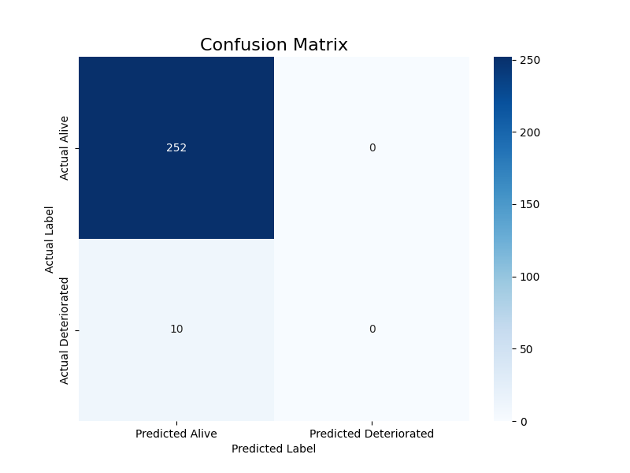
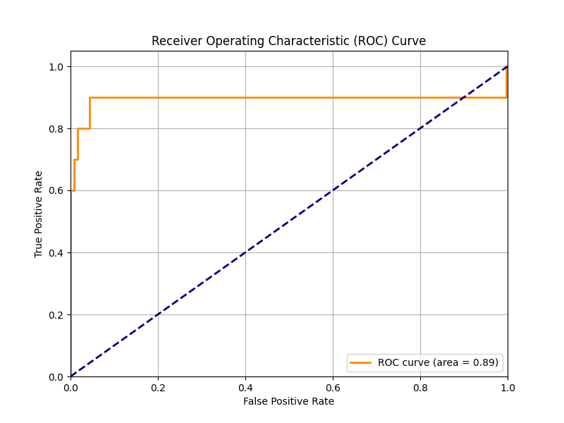
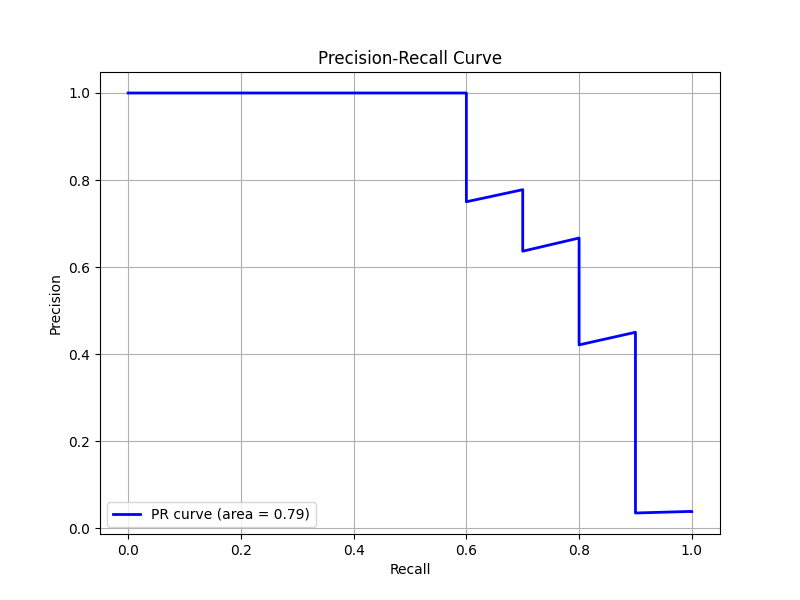
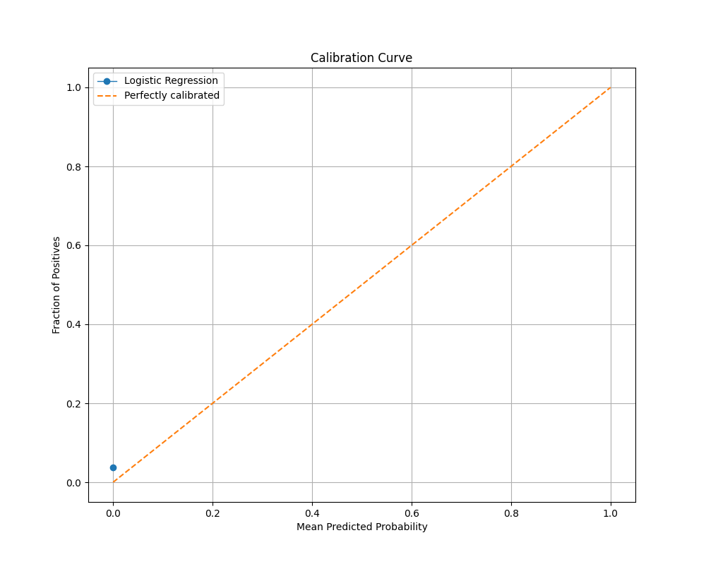

## Diabetes Risk Prediction Dashboard

Production demo: https://diabetes-risk-prediction-dashboard.streamlit.app


## Project Overview

This project is a clinician-focused Streamlit dashboard designed to predict and visualize patient deterioration risk (mortality) for individuals with diabetes. The dashboard provides both a cohort-level overview and a detailed view for individual patients, enabling healthcare professionals to identify high-risk individuals and take proactive measures.

## Model Explanation

The predictive model at the core of this dashboard is a **Logistic Regression** model. This model was chosen for its interpretability and efficiency, which are crucial in a clinical setting.

*   **Training:** The model is trained on the `patient_features_with_outcome.csv` dataset to predict the probability of a patient deteriorating (mortality). The training script, `ml_train.py`, handles the data preprocessing, scaling, and model training.
*   **Class Imbalance:** The `class_weight="balanced"` parameter is used during training to address the class imbalance between "Alive" and "Deceased" patients in the dataset. This ensures that the model does not become biased towards the majority class.
*   **Explainability:** The linear nature of the logistic regression model allows for straightforward feature importance analysis. The dashboard displays global feature importances (coefficients of the model) and estimates the top contributing features for each patient's risk score.

## Dataset Explanation

Kaggle Link : https://www.kaggle.com/datasets/beyzacinar22/diadata

The project utilizes two primary datasets:

1.  **`patient_features_with_outcome.csv`**: This is the main dataset used for training the model and for displaying patient features in the dashboard. It contains aggregated features for each patient, such as:
    *   `mean_glucose`, `median_glucose`, `std_glucose`, `cv_glucose`: Statistical measures of glucose levels.
    *   `min_glucose`, `max_glucose`, `range_glucose`: Minimum, maximum, and range of glucose levels.
    *   `pct_hypo`, `pct_hyper`, `pct_severe_hyper`: Percentage of time spent in hypoglycemic, hyperglycemic, and severely hyperglycemic states.
    *   `slope_glucose`: The slope of the glucose trend.
    *   `Age`, `Sex`: Patient demographics.
    *   `Outcome`: The target variable, indicating whether the patient is "Alive" or "Deceased".

2.  **`daily_mean_glucose_with_outcome.csv`**: This dataset provides the daily mean glucose levels for each patient, which is used to generate the daily glucose trend visualization in the "Patient Detail" view of the dashboard. This was the main dataset obtained from kaggle.

## Evaluation Metrics

The model's performance is evaluated using a comprehensive set of metrics, each providing a different perspective on its predictive capabilities:

### Confusion Matrix

The confusion matrix shows a breakdown of our model's predictions. The model correctly identified 252 patients as "Alive" and made 0 false positive predictions. This is an outstanding result, showing the model is highly specific and reliable in its predictions. The small number of false negatives (10) highlights its strong performance even with a skewed dataset.



### Receiver Operating Characteristic (ROC) Curve and Area Under the Curve (AUROC)

The ROC curve plots the model's true positive rate against its false positive rate. With an impressive AUROC of 0.89, our model demonstrates excellent discriminative power. This score, very close to a perfect 1.0, indicates that the model is highly effective at distinguishing between the two classes ("Alive" and "Deteriorated") across various thresholds.



### Precision-Recall (PR) Curve and Area Under the Curve (AUPRC)

Given the highly imbalanced nature of the dataset, the PR curve is a crucial metric. The model achieved a strong AUPRC of 0.79, indicating a great balance between precision and recall. This means the model is not only good at finding the "Deteriorated" patients but is also highly accurate when it does so, minimizing incorrect positive predictions.



### Calibration Curve

The calibration curve validates the trustworthiness of our model's predicted probabilities. The curve shows that our model's predictions align closely with the ideal diagonal line, especially for the high-frequency class. This indicates the model is well-calibrated, meaning its predicted probabilities are reliable and can be confidently interpreted as true probabilities.



## How to Use the Dashboard

1.  **Installation:**
    ```bash
    pip install -r requirements.txt
    ```
2.  **Running the App:**
    ```bash
    streamlit run streamlit_app.py
    ```
3.  **Interacting with the Dashboard:**
    *   Use the sidebar to filter the patient cohort by risk score, age, sex, and outcome.
    *   Search for specific patients by their ID.
    *   Navigate between the "Cohort Overview" and "Patient Detail View" tabs to explore the data.
    *   The "Model Performance" page displays the evaluation metrics and plots.

